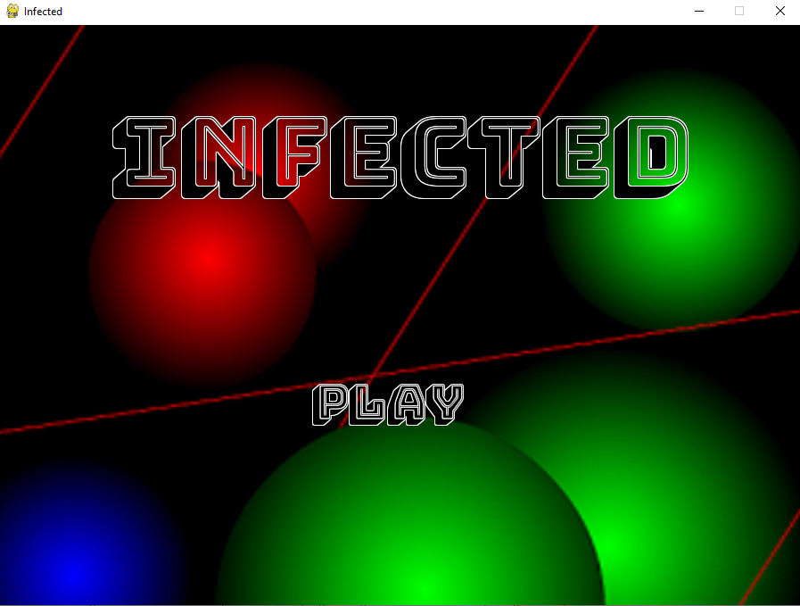
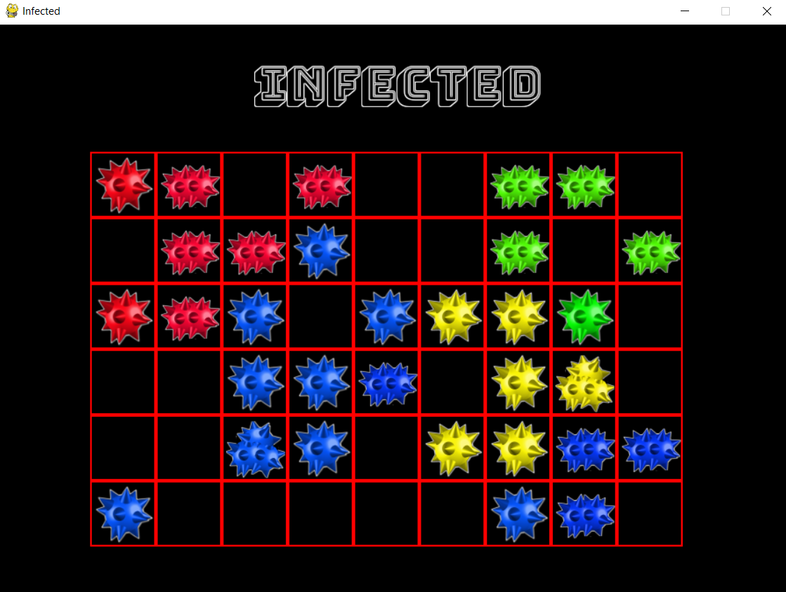

# Infected

Remake of the [Chain Reaction](https://apps.apple.com/us/app/chain-reaction-game/id1592677727) strategy arcade game! Made in 24 hours using PyGame! ([Demo Video](https://youtu.be/7iWkoGkyd_Y))

By [Cameron Beneteau](https://github.com/CameronBeneteau), [Tailai Wang](https://github.com/tailaiwang), [Hamza Saquib](https://github.com/hamzasaqib890), and [Luka David](https://github.com/LukaDavid04)  
Event: [MasseyHacks III](https://mh3.masseyhacks.ca/) (Grade 10)  
Date: April 1-2, 2017

## Table of Contents
[1. Intro](#Intro)  
[2. Gameplay](#Gameplay)  
[3. Environment Setup](#Environment-Setup)  
[4. How to Play](#How-to-Play)  
[5. Results](#Results)  
[6. Next Steps](#Next-Steps)

## Intro

This is a two to four-player turn-based strategy game inspired by the arcade game [Chain Reaction](https://apps.apple.com/us/app/chain-reaction-pro-bombs/id993527516).

This game was made using Python and PyGame. It utilizes object-oriented programming and other high school computing techniques.

## Gameplay

Check out the demo video for this project [here](https://youtu.be/7iWkoGkyd_Y)!

  

## Environment Setup

To successfully run this project, please follow these steps to set up your environment:

1. Python 3.0 or later ([Download Python](https://www.python.org/downloads/))
2. Any IDE that runs Python (we recommend [IDLE](https://www.python.org/downloads/), [IntelliJ IDEA](https://www.jetbrains.com/idea/) or [VS Code](https://code.visualstudio.com/download))
3. PyGame Module installed to your version of Python ([Download PyGame](https://www.python.org/downloads/))
4. Ensure your IDE is configured to use the above version of Python and PyGame

## How to Play

All instructions can be found in the game after pressing "Play" button on the main screen.

Run the [Infected.py](Infected.py) file to play!

## Results

We are extremely happy we were able to participate in MasseyHacks III to build this project.

The 24-hour time constraint was easily the hardest but most enjoyable part of this experience.

It was a big challenge to try to build a game this fast, but our team had great planning and teamwork skills throughout this development process to get it done

Although this game did not win any prizes at the hackathon, it was awesome to see our creation come to life - especially after letting the judges and other hackers play against each other!

## Next Steps
Some fun things we would like to build on or explore relating to this project would be:

- Ability for players to play against the computer (at various difficulties)
- Sound effects to various in-game events
- Cleaner split animations
